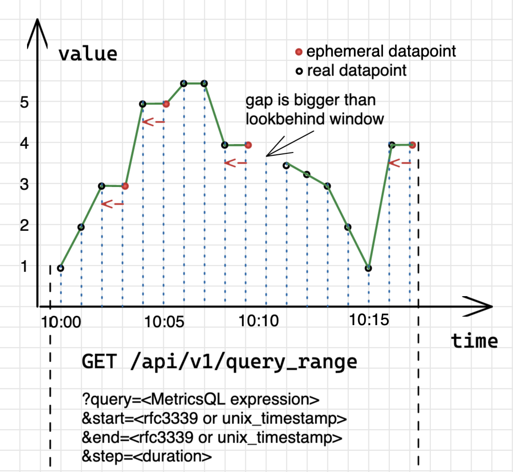

# Quick start
//todo

## How to install VM

The following commands download the latest available [Docker image of VictoriaMetrics](https://hub.docker.com/r/victoriametrics/victoria-metrics) and start it at port 8428, while storing the ingested data at `victoria-metrics-data` subdirectory under the current directory:

```bash
docker pull victoriametrics/victoria-metrics:latest
docker run -it --rm -v `pwd`/victoria-metrics-data:/victoria-metrics-data -p 8428:8428 victoriametrics/victoria-metrics:latest
```

Open `http://localhost:8428` in web browser and read [these docs](https://docs.victoriametrics.com/#operation).

Or installing a [binary](https://github.com/VictoriaMetrics/VictoriaMetrics/releases)  and passing a -selfScrape flag to it. (more info coming…)

## Data model

### What is a metric

Simply put, `metric` - is a measure of something. The measurement can be used to describe the process,
compare it to other process, perform some calculations with it or even define events triggering on reaching
user-defined thresholds.

The most common use-cases for metrics are:
- check how the system behaves at the particular time period;
- correlate behaviour changes to other measurements;
- observe or forecast trends;
- trigger events (alerts) if metric exceeds threshold.

Collecting and analyzing metrics provides advantages which are difficult to overestimate.

### Structure of a metric

Metric is an observation of something. For example, if we're going to track how many requests our
application serves, we'll define a metric with name `requests_total`.

You can be more specific here by saying “requests_success_total” (for only successful requests)
or “request_errors_total” (for errors only). Choosing a metric name is very important and supposed
to clarify what is actually measured to every person who reads it, just like variable names in programming.

Every metric can contain additional meta information in the form of label-value pairs:
```
requests_total{path="/", code="200"} 
requests_total{path="/", code="403"} 
```

The meta information (labels in curly braces) gives us a context for which `path` and with what `code`
the `request` was served. Label-value pairs are always of a `string` type. VictoriaMetrics data model
is schemaless, which means there is no need to define metric names or their labels in advance.
User is free to add or change ingested metrics anytime.

Actually, metric's name is also a label with a special name `__name__`. So the following two series are identical:
```
requests_total{path="/", code="200"} 
{__name__="requests_total", path="/", code="200"} 
```

A combination of a metric name and its labels defines a `time series`.
For example, `requests_total{path="/", code="200"}` and `requests_total{path="/", code="403"}`
are two different time series.

The number of all unique labels combinations for one metric defines its `cardinality`.
For example, if `requests_total` has 3 unique `path` values and 5 unique `code` labels,
then its cardinality will be `3*5=15` of unique time series.

Every time series consists of `datapoints` (also called `samples`).
A `datapoint` is value-timestamp pair associated with the specific series:
```
requests_total{path="/", code="200"} 1 1652094080000
```

In VictoriaMetrics data model, datapoint's value is of type `float64`.
And timestamp is unixtime with milliseconds precision. Each series can contain infinite number of datapoints.


### Types of metrics

Internally, VictoriaMetrics does not have a notion of a metric type. All metrics are the same.
However, the concept of a metric type exists specifically to help user to understand how the metric was measured.
There are 4 common metric types.

#### Counter

Counter metric type is a [monotonically increasing counter](https://en.wikipedia.org/wiki/Monotonic_function)
used for capturing a number of events.
It represents a cumulative metric which value never goes down and always shows the current number of captured
events. In other words, `counter` always shows the number of observed events since the application has started.
In programming, `counter` is a variable that you increment each time something happens.


`vm_http_requests_total` is a typical example of a counter - a metric which only grows.
The interpretation of a graph above is that time series
`vm_http_requests_total{instance="localhost:8428", job="victoriametrics", path="api/v1/query_range"}`
was rapidly changing from 1:38 pm to 1:39 pm, then there were no changes until 1:41 pm.

Counter is used for measuring number of events, like number of requests, errors, logs, messages etc.
The most common [MetricsQL](#metricsql) functions used with counters are:
* [rate](https://docs.victoriametrics.com/MetricsQL.html#rate) - calculates the speed of metric's change.
  For example, `rate(requests_total)` will show how many requests are served per second;
* [increase](https://docs.victoriametrics.com/MetricsQL.html#increase) - calculates the growth of a metric
  on the given time period. For example, `increase(requests_total[1h])` will show how many requests were
  served over `1h` interval.

#### Gauge
TODO
Gauge measures a value which can go up and down. For example, a temperature, memory or CPU usage:


#### Histogram
TODO
Histogram is a graphical representation of time series, organized on a specified range. It is used to show how often the different values occur in a dataset.
A range shown on the x-axis while response size on the buckets is represented by the y-axis.


histogram(process_resident_memory_bytes)

#### Summary
TODO
Summary is quite similar to histogram meant to calculate the average of the observed values to calculate [quantiles](https://prometheus.io/docs/practices/histograms/#quantiles)

For simplicity of studying and analyzing the collected metrics which are just raw data  - it should be visualized. Programming languages exist for this purpose, for example - PromQL and MetricsQL. Created for convenience of operating the collected data by allowing to perform mathematical functions and aggregation over the collected data. This allows building graphs via vmui or grafana.


### Collecting data


There are 2 modells for data collection - pull and push
In simple words:
Pull model - service has an endpoint (usually /metrics) that gives metrics upon the request. The requester sets the timestamp upon receiving those metrics.
Push model - service writes metrics directly with timestamps and values.
Most popular product for metrics collection support only one model for metrics collection. Prometheus supports pull model. Graphite and influxDB support the Push model.
Victoria Metrics supports both pull and push model and it works like this:
Push model - something writes data to vm
Pull model - vm goes somewhere collects metrics and writes to itself
As a practical example of a Pull model in VM, to start collecting metrics -  identifying the `target` is required  (it can be custom applications, node-exporter, etc.) on a local machine or a specific node/pod of virtual environment. `VMSingle-server` can be used to scrape the exposed metrics on required targets. This `target` should be specified in `config.yml` (in most cases, people were transferring from Prometheus, so the config file used is prometheus.yml ) for `VMSingle-server` to understand it. To start the scraping process, `VMSingle-server` should be launched with a flag specifying the path to `config.yml` an example ` -promscrape.config=/…/config.yml`. If done correctly, the `target` and its status should be shown in `vmui` under the “Targets” field.


## Writing data
TODO
The easiest way to have some first, hands on experience with writing data to VictoriaMetrics is to import some data using curl to /api/v1/import/csv

curl -d "GOOG,1.23,4.56,NYSE" 'http://localhost:8428/api/v1/import/csv?format=2:metric:ask,3:metric:bid,1:label:ticker,4:label:market'
curl -d "MSFT,3.21,1.67,NASDAQ" 'http://localhost:8428/api/v1/import/csv?format=2:metric:ask,3:metric:bid,1:label:ticker,4:label:market'

Second step is to send the scrapped metrics to the database or other specified destination. For this a specific flag `-remoteWrite.url` is used upon starting `vmagent` or `VMSingle-server`. It is also possible to specify it in `config.yml` file. `VMSingle-server` or `vmstorage` can be used as a database. `vmstorage` is used in cluster setup and storing data directly to it is not possible. Scrapped data should go to `vminsert` and it will direct it to configured `vmstorage` in cluster setup.


## Query basics
VictoriaMetrics provides an [HTTP API](https://docs.victoriametrics.com/Single-server-VictoriaMetrics.html#prometheus-querying-api-usage)
for serving read queries. The API is used in various integrations such as
[Grafana](https://docs.victoriametrics.com/Single-server-VictoriaMetrics.html#grafana-setup).
The same API is also used by
[VMUI](https://docs.victoriametrics.com/Single-server-VictoriaMetrics.html#vmui) - graphical User Interface
for querying and visualizing metrics.

The API consists of two main handlers: [instant](#instant-query) and [range queries](#range-query).

### Instant query

Instant query executes the query expression at the given moment of time:
```
GET | POST /api/v1/query

Params:
query - MetricsQL expression, required
time - when (rfc3339 | unix_timestamp) to evaluate the query. If omitted, current timestamp is used
step - max lookback window if no datapoints found at the given time. If omitted, is set to 5m
```

To understand how instant queries work, let's begin with a data sample:
```
foo_bar 1.00 1652169600000 # 2022-05-10 10:00:00
foo_bar 2.00 1652169660000 # 2022-05-10 10:01:00
foo_bar 3.00 1652169720000 # 2022-05-10 10:02:00
foo_bar 5.00 1652169840000 # 2022-05-10 10:04:00, one point missed
foo_bar 5.50 1652169960000 # 2022-05-10 10:06:00, one point missed
foo_bar 5.50 1652170020000 # 2022-05-10 10:07:00
foo_bar 4.00 1652170080000 # 2022-05-10 10:08:00
foo_bar 3.50 1652170260000 # 2022-05-10 10:11:00, two points missed
foo_bar 3.25 1652170320000 # 2022-05-10 10:12:00
foo_bar 3.00 1652170380000 # 2022-05-10 10:13:00
foo_bar 2.00 1652170440000 # 2022-05-10 10:14:00
foo_bar 1.00 1652170500000 # 2022-05-10 10:15:00
foo_bar 4.00 1652170560000 # 2022-05-10 10:16:00
```

The data sample contains a list of samples for one time series with time intervals between
samples from 1m to 3m. If we plot this data sample on the system of coordinates, it will have the following form:


To get the value of `foo_bar` metric at some specific moment of time, for example `2022-05-10 10:03:00`,
in VictoriaMetrics we need to issue an **instant query**:
```bash
curl "http://<victoria-metrics-addr>/api/v1/query?query=foo_bar&time=2022-05-10T10:03:00.000Z"
```
```json
{"status":"success","data":{"resultType":"vector","result":[{"metric":{"__name__":"foo_bar"},"value":[1652169780,"3"]}]}}
```

In response, VictoriaMetrics returns a single sample-timestamp pair with value of `3` for the series
`foo_bar` at the given moment of time `2022-05-10 10:03`. But, if we take a look at the origin data sample again,
we'll see that there is no data point at `2022-05-10 10:03`. What happens here is if there is no data point at the
requested timestamp, VictoriaMetrics will try to locate the closest sample on the left to the requested timestamp:


The time range at which VictoriaMetrics will try to locate a missing data sample is equal to `5m`
by default and can be overridden via `step` parameter.

Instant query can return multiple time series, but always only one data sample per series.
Instant queries are used in the following scenarios:
* Getting the last recorded value;
* For alerts and recording rules evaluation;
* Plotting Stat or Table panels in Grafana.


### Range query

Range query executes the query expression at the given time range with the given step:
```
GET | POST /api/v1/query_range

Params:
query - MetricsQL expression, required
start - beginning (rfc3339 | unix_timestamp) of the time rage, required
end - end (rfc3339 | unix_timestamp) of the time range. If omitted, current timestamp is used 
step - step in seconds for evaluating query expression on the time range. If omitted, is set to 5m
```

To get the values of `foo_bar` on time range from `2022-05-10 09:59:00` to `2022-05-10 10:17:00`,
in VictoriaMetrics we need to issue a range query:
```bash
curl "http://<victoria-metrics-addr>/api/v1/query_range?query=foo_bar&step=1m&start=2022-05-10T09:59:00.000Z&end=2022-05-10T10:17:00.000Z"
```
```json
{"status":"success","data":{"resultType":"matrix","result":[{"metric":{"__name__":"foo_bar"},"values":[[1652169600,"1"],[1652169660,"2"],[1652169720,"3"],[1652169780,"3"],[1652169840,"7"],[1652169900,"7"],[1652169960,"7.5"],[1652170020,"7.5"],[1652170080,"6"],[1652170140,"6"],[1652170260,"5.5"],[1652170320,"5.25"],[1652170380,"5"],[1652170440,"3"],[1652170500,"1"],[1652170560,"4"],[1652170620,"4"]]}]}}
```

In response, VictoriaMetrics returns `17` sample-timestamp pairs for the series `foo_bar` at the given time range
from  `2022-05-10 09:59:00` to `2022-05-10 10:17:00`. But, if we take a look at the origin data sample again,
we'll see that it contains only 13 data points. What happens here is that the range query is actually
an [instant query](#instant-query) executed `(start-end)/step` times on the time range from `start` to `end`.
If we plot this request in VictoriaMetrics the graph will be showed as the following:



The blue dotted lines on the pic are the moments when instant query was executed.
Since instant query retains the ability to locate the missing point, the graph contains two types of
points: `real` and `ephemeral` data points. The `ephemeral` data point always repeats the left closest `real`
data point (red arrow).

This behaviour of adding ephemeral data points comes from the specifics of the [Pull model](#pull-model):
* Metrics are scraped at fixed intervals;
* Scrape may be skipped if monitoring system is overloaded;
* Scrape may fail due to network issues.

According to these specifics, the range query assumes that if there is a missing data point then it is likely
a missed scrape, so it fills it with the previous data point. The same will work for cases when `step` is
lower than actual interval between samples. In fact, if we set `step=1s` for the same request, we'll get about
1 thousand data points in response, where most of them are `ephemeral`.

Sometimes, the lookbehind window for locating the datapoint isn't big enough and the graph will contain a gap.
For range queries, lookbehind window isn't equal to the `step` parameter. It is calculated as the median of the
intervals between the first 20 data points on the requested time range. In this way, VictoriaMetrics automatically
adjusts the lookbehind window to fill gaps and detect stale series at the same time.

Range queries are mostly used for plotting time series data over specified time ranges.
These queries are extremely useful in the following scenarios:
* Track the state of a metric on the time interval;
* Correlate changes between multiple metrics on the time interval;
* Observe trends and dynamics of the metric change.

### MetricsQL
VictoriaMetrics provide a special query language for executing read queries - [MetricsQL](https://docs.victoriametrics.com/MetricsQL.html).
MetricsQL is a [PromQL](https://prometheus.io/docs/prometheus/latest/querying/basics/)-like query language
with a powerful set of functions and features for working specifically with time series data.
MetricsQL is backwards-compatible with PromQL, so it shares most of the query concepts.
For example, the basics concepts of PromQL described [here](https://valyala.medium.com/promql-tutorial-for-beginners-9ab455142085)
are applicable to MetricsQL as well.

#### Filtering

In sections [instant query](#instant-query) and [range query](#range-query) we've already used MetricsQL
to get data for metric `foo_bar`. It is as simple as just writing a metric name in the query:
```MetricsQL
foo_bar
```

A single metric name may correspond to multiple time series with distinct label sets. For example:
```MetricsQL
requests_total{path="/", code="200"} 
requests_total{path="/", code="403"} 
```

To select only time series with specific label value specify the matching condition in curly braces:
```MetricsQL
requests_total{code="200"} 
```

The query above will return all time series with a name `requests_total` and `code="200"`.
We use operator `=` to match a label value. For negative match use `!=` operator.
Filters also support regex matching `=~` for positive and `!~` for negative matching:
```MetricsQL
requests_total{code=~"2.*"}
```

Filters can also be combined:
```MetricsQL
requests_total{code=~"200|204", path="/home"}
```
The query above will return all time series with a name `requests_total`,
status `code` `200` or `204` and `path="/home"`.

#### Filtering by name

Sometimes it is required returning all the time series for multiple metric names.
As was mentioned in the [data model section](#data-model), metric name is just an ordinary label with
a special name — `__name__`. So filtering by multiple metric names may be performed by applying regexps
on metric names:
```MetricsQL
{__name__=~"requests_(error|success)_total"}
```
The query above is supposed to return series for two metrics: `requests_error_total` and `requests_success_total`.

#### Arithmetic operations
MetricsQL supports all the basic arithmetic operations:
* addition (+)
* subtraction (-)
* multiplication (*)
* division (/)
* modulo (%)
* power (^)

This allows performing various calculations. For example, the following query will calculate
the percentage of error requests:
```MetricsQL
(requests_error_total / (requests_error_total + requests_success_total)) * 100
```

#### Combining multiple series
Combining multiple time series with arithmetic operations requires understanding of matching rules.
Otherwise, the query may break or may lead to incorrect results. The basics of the matching rules are simple:
* MetricsQL engine strips metric names from all the time series on the left and right side of the arithmetic
  operation without touching labels.
* For each time series on the left side MetricsQL engine searches for the corresponding time series on
  the right side with the same set of labels, applies the operation for each data point and returns the resulting
  time series with the same set of labels. If there are no matches, then the time series is dropped from the result.
* The matching rules may be augmented with ignoring, on, group_left and group_right modifiers.

This could be really complex, but in the majority of cases isn’t needed.

#### Comparison operations

MetricsQL supports the following comparison operators:
* equal (==)
* not equal (!=)
* greater (>)
* greater-or-equal (>=)
* less (<)
* less-or-equal (<=)

These operators may be applied to arbitrary MetricsQL expressions as with arithmetic operators.
The result of the comparison operation is time series with the only matching data points.
For instance, the following query would return series only for processes where memory usage is > 100MB:
```MetricsQL
process_resident_memory_bytes > 100*1024*1024
```

#### Aggregation and grouping functions

MetricsQL allows aggregating and grouping time series.
Time series are grouped by the given set of labels and then the given aggregation function is applied
for each group. For instance, the following query would return memory used by various processes grouped
by instances (for case when multiple processes run on the same instance):
```MetricsQL
sum(process_resident_memory_bytes) by (instance)
```

#### Calculating rates

One of the most widely used functions for [counters](#counter) is [rate](https://docs.victoriametrics.com/MetricsQL.html#rate).
It calculates per-second rate for all the matching time series. For example, the following query will show
how many bytes are received by network per second:
```MetricsQL
rate(node_network_receive_bytes_total)
```

To calculate the rate, query engine will need at least two data points to compare.
Simplified rate calculation for each point looks like `(Vcurr-Vprev)/(Tcurr-Tprev)`,
where `Vcurr` is the value at the current point — `Tcurr`, `Vprev` is the value at the point `Tprev=Tcurr-step`.
The range between `Tcurr-Tprev` is usually equal to `step` parameter.
If `step` value is lower than real interval between data points, then it is ignored and minimum real interval is used.

The interval on which `rate` needs to be calculated can be specified explicitly as `duration` in square brackets:
```MetricsQL
 rate(node_network_receive_bytes_total[5m])
```
For this query the time duration to look back when calculating per-second rate for each point on the graph
will be equal to `5m`.

`rate` strips metric name while leaving all the labels for the inner time series.
Do not apply `rate` to time series which may go up and down, such as [gauges](#gauge).
`rate` must be applied only to [counters](#counter), which always go up.
Even if counter gets resetted (for instance, on service restart), `rate` knows how to deal with it.

#### Visualizing time series
VictoriaMetrics has built-in graphical User Interface for querying and visualizing metrics
[VMUI](https://docs.victoriametrics.com/Single-server-VictoriaMetrics.html#vmui).
Open `http://victoriametrics:8428/vmui` page, type the query and see the results:


VictoriaMetrics supports [Prometheus HTTP API](https://prometheus.io/docs/prometheus/latest/querying/api/)
which makes it possible to [use with Grafana](https://docs.victoriametrics.com/Single-server-VictoriaMetrics.html#grafana-setup).
Play more with Grafana integration in VictoriaMetrics sandbox [https://play-grafana.victoriametrics.com](https://play-grafana.victoriametrics.com).


